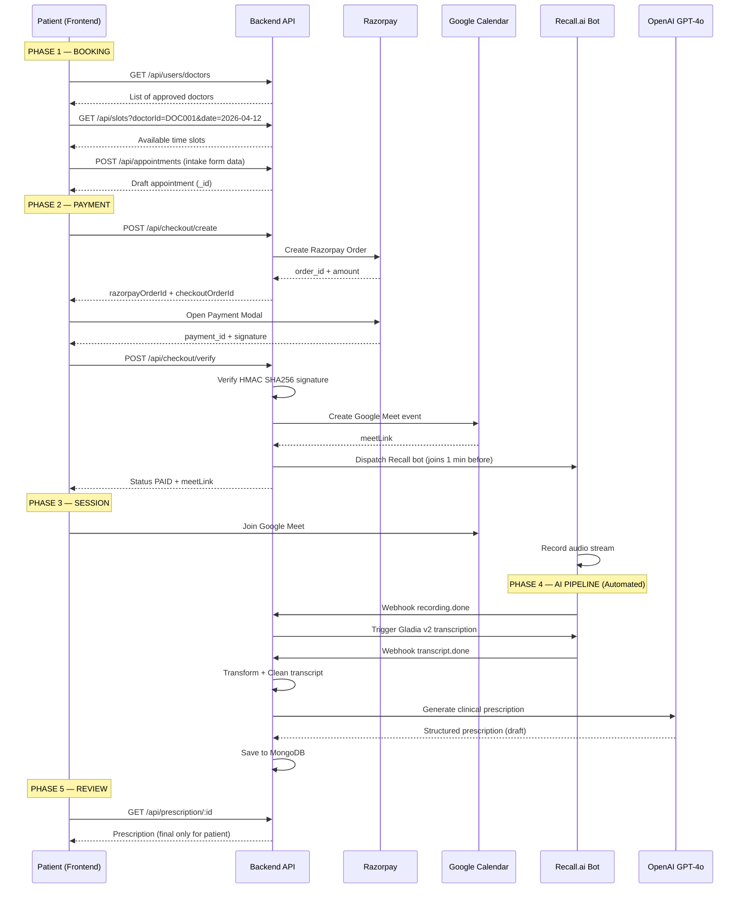

# Calmscious Frontend Integration Guide
## Complete Pipeline: Slot Booking → Payment → Meet → Transcription → Prescription

> [!IMPORTANT]
> This document contains the **exact** request payloads, response schemas, environment variables, and step-by-step flow for the entire Calmscious platform. Follow each step sequentially.

---

## 1. Frontend Environment Variables

```env
# API
REACT_APP_API_URL=https://your-ngrok-or-domain.app/api

# Razorpay (Public Key Only — safe for frontend)
REACT_APP_RAZORPAY_KEY=rzp_test_SHTwJN4z94DatM

# Google OAuth
REACT_APP_GOOGLE_CLIENT_ID=567934719636-vbrqd1dfknfq5r5aat2kunosto7stk09.apps.googleusercontent.com
```

> [!WARNING]
> Never expose `RAZORPAY_KEY_SECRET`, `JWT_ACCESS_SECRET`, or `OPENAI_API_KEY` in the frontend. These are backend-only secrets.

---

## 2. Axios Interceptor Setup

Every API call must attach the JWT token. Set this up once globally.

```javascript
import axios from "axios";

const api = axios.create({
  baseURL: process.env.REACT_APP_API_URL,
  withCredentials: true, // Required for cookie-based auth
});

// Attach token to every request
api.interceptors.request.use((config) => {
  const token = localStorage.getItem("accessToken");
  if (token) {
    config.headers.Authorization = `Bearer ${token}`;
  }
  return config;
});

// Handle 401 (Token Expired) → Auto Refresh
api.interceptors.response.use(
  (res) => res,
  async (error) => {
    if (error.response?.status === 401) {
      const refreshToken = localStorage.getItem("refreshToken");
      if (refreshToken) {
        try {
          const { data } = await axios.post(
            `${process.env.REACT_APP_API_URL}/auth/refresh`,
            { refreshToken }
          );
          localStorage.setItem("accessToken", data.data.accessToken);
          error.config.headers.Authorization = `Bearer ${data.data.accessToken}`;
          return api(error.config); // Retry original request
        } catch {
          localStorage.clear();
          window.location.href = "/login";
        }
      }
    }
    return Promise.reject(error);
  }
);

export default api;
```

---

## 3. Authentication

### 3A. Patient Login (Google OAuth)

```
POST /api/auth/google
```

**Request:**
```json
{
  "code": "4/0AfDhwOhi..." 
}
```
> The `code` comes from the `@react-oauth/google` SDK's `useGoogleLogin` hook.

**Response (200):**
```json
{
  "statusCode": 200,
  "data": {
    "user": {
      "_id": "698f40bf9fc3bcac49138755",
      "name": "Sarah Stuart",
      "email": "sarah@gmail.com",
      "role": "PATIENT",
      "status": "APPROVED",
      "isActive": true
    },
    "accessToken": "eyJhbGciOiJIUzI1NiIs...",
    "refreshToken": "eyJhbGciOiJIUzI1NiIs..."
  },
  "message": "Success"
}
```

**Frontend Action:** Save `accessToken` and [refreshToken](file:///Users/apurv79/F/calmscious/frontend/src/modules/auth/services/auth.service.js#31-37) to `localStorage`. Redirect to Patient Dashboard.

---

### 3B. Doctor / Admin Login (Credentials)

```
POST /api/auth/login
```

**Request:**
```json
{
  "identifier": "DOC001",
  "password": "Doctor@123"
}
```
> `identifier` can be the `doctorId` (e.g. `DOC001`) OR the email address.

**Response (200):** Same shape as Google login above, but [role](file:///Users/apurv79/F/calmscious/backend/src/middlewares/role.middleware.js#1-12) will be `"DOCTOR"` or `"ADMIN"`.

---

### 3C. Fetch Current User Profile

```
GET /api/user/me
```

**Headers:** `Authorization: Bearer <accessToken>`

**Response (200):**
```json
{
  "statusCode": 200,
  "data": {
    "_id": "698f42fa9ce64a3516f01cb7",
    "name": "Dr. Mehta",
    "email": "dr.mehta@calmscious.com",
    "role": "DOCTOR",
    "doctorId": "DOC001",
    "status": "APPROVED",
    "isActive": true
  },
  "message": "Success"
}
```

**Frontend Action:** Store in global state (Zustand/Redux). Use [role](file:///Users/apurv79/F/calmscious/backend/src/middlewares/role.middleware.js#1-12) to conditionally render dashboard components.

---

## 4. The Complete Appointment Pipeline

### STEP 1: Select a Doctor

```
GET /api/users/doctors
```

**Headers:** `Authorization: Bearer <token>`

**Response (200):**
```json
{
  "statusCode": 200,
  "data": [
    {
      "_id": "698f42fa9ce64a3516f01cb7",
      "name": "Dr. Mehta",
      "email": "dr.mehta@calmscious.com",
      "role": "DOCTOR",
      "doctorId": "DOC001",
      "status": "APPROVED",
      "isActive": true
    }
  ],
  "message": "Success"
}
```

**Frontend Action:** Display as cards. User clicks a doctor → navigate to Calendar page with `doctorId`.

---

### STEP 2: Pick a Date & View Available Slots

```
GET /api/slots?doctorId=DOC001&date=2026-04-12
```

**No auth required (PUBLIC).**

**Response (200):**
```json
{
  "statusCode": 200,
  "data": [
    {
      "startTime": "10:00",
      "endTime": "11:00",
      "isBooked": false,
      "isManuallyBlocked": false
    },
    {
      "startTime": "11:00",
      "endTime": "12:00",
      "isBooked": true,
      "isManuallyBlocked": false
    },
    {
      "startTime": "14:00",
      "endTime": "15:00",
      "isBooked": false,
      "isManuallyBlocked": false
    }
  ],
  "message": "Slots fetched"
}
```

**Frontend Logic:**
- Render each slot as a clickable chip/button.
- If `isBooked === true` OR `isManuallyBlocked === true` → disable the chip (grey out).
- On click → store `startTime` (e.g. `"10:00"`) and the selected [date](file:///Users/apurv79/F/calmscious/backend/src/modules/appointment/appointment.repository.js#10-12) in local state.

---

### STEP 3: Fill the Intake Form & Create Draft Appointment

This maps directly to your **FIGMA "Add Details" screen**.

```
POST /api/appointments
```

**Headers:** `Authorization: Bearer <token>`

**Request:**
```json
{
  "doctorId": "DOC001",
  "date": "2026-04-12",
  "slotId": "10:00",
  "meetingType": "GOOGLE_MEET",
  "problemDescription": "Anxiety and restlessness for 3 months",
  "problemDuration": "3 months",
  "guestEmails": ["friend@email.com"]
}
```

> [!NOTE]
> **Field Mapping from FIGMA:**
> | FIGMA Field | API Field |
> |---|---|
> | First Name / Email | Extracted from logged-in user's profile (`/api/user/me`) |
> | Phone Number | Extracted from logged-in user's profile |
> | What Kind of Problems | `problemDescription` |
> | How Long Do You Have These Issues | `problemDuration` |
> | Meeting Type (Google Meet / Inbound Call / In Office) | `meetingType` — Enum: `GOOGLE_MEET`, `INBOUND_CALL`, `IN_OFFICE` |
> | Guest Emails | `guestEmails` — Array of strings |

**Response (201):**
```json
{
  "statusCode": 201,
  "data": {
    "_id": "69ca1234abcd5678ef901234",
    "doctorId": "DOC001",
    "userId": "698f40bf9fc3bcac49138755",
    "startTime": "2026-04-12T10:00:00.000Z",
    "endTime": "2026-04-12T11:00:00.000Z",
    "status": "CREATED",
    "meetingType": "GOOGLE_MEET",
    "problemDescription": "Anxiety and restlessness for 3 months",
    "problemDuration": "3 months",
    "guestEmails": ["friend@email.com"],
    "orderId": "order_1774800000000"
  },
  "message": "Created"
}
```

**Frontend Action:** Save the `_id` as `appointmentId`. This is needed for the next step.

---

### STEP 4: Get Consultation Fee

```
GET /api/appointments/config/pricing
```

**No auth required.**

**Response (200):**
```json
{
  "statusCode": 200,
  "data": { "amount": 2499 },
  "message": "Price fetched"
}
```

---

### STEP 5: Create Unified Checkout Order (Razorpay)

This bundles the appointment + any optional books/courses into a single payment.

```
POST /api/checkout/create
```

**Headers:** `Authorization: Bearer <token>`

**Request (Appointment Only):**
```json
{
  "appointmentId": "69ca1234abcd5678ef901234"
}
```

**Request (Appointment + Masterclass + Book — Full Basket):**
```json
{
  "appointmentId": "69ca1234abcd5678ef901234",
  "courseIds": ["69c8009db2d4ea8e6b656f60"],
  "books": [
    {
      "bookId": "69c84e9bddfe605b1c1f9536",
      "type": "DIGITAL"
    }
  ]
}
```

**Response (200):**
```json
{
  "statusCode": 200,
  "data": {
    "checkoutOrderId": "69ca5678efgh1234ijkl5678",
    "razorpayOrderId": "order_SXyz1234ABcd",
    "amount": 319900,
    "currency": "INR"
  },
  "message": "Success"
}
```

> [!IMPORTANT]
> `amount` is in **paise** (₹3199 = 319900 paise). Pass this directly to the Razorpay SDK.

---

### STEP 6: Open Razorpay Payment Modal

This is **entirely client-side**. No API call needed.

```javascript
const openRazorpay = (checkoutData) => {
  const options = {
    key: process.env.REACT_APP_RAZORPAY_KEY, // "rzp_test_SHTwJN4z94DatM"
    amount: checkoutData.amount,              // 319900 (paise)
    currency: "INR",
    order_id: checkoutData.razorpayOrderId,   // "order_SXyz1234ABcd"
    name: "Calmscious",
    description: "Consultation & Calmscious Session",
    handler: function (response) {
      // Step 7: Verify Payment
      verifyPayment({
        orderId: checkoutData.checkoutOrderId,       // Our internal ID
        paymentId: response.razorpay_payment_id,     // "pay_SXyz5678EFgh"
        signature: response.razorpay_signature,      // "hmac_sha256_hash"
      });
    },
    prefill: {
      name: user.name,
      email: user.email,
      contact: user.phone,
    },
    theme: { color: "#0d9488" },
  };

  const rzp = new window.Razorpay(options);
  rzp.open();
};
```

> [!NOTE]
> Load the Razorpay SDK script in your `index.html`:
> ```html
> <script src="https://checkout.razorpay.com/v1/checkout.js"></script>
> ```

---

### STEP 7: Verify Payment & Unlock Content

```
POST /api/checkout/verify
```

**Headers:** `Authorization: Bearer <token>`

**Request:**
```json
{
  "orderId": "69ca5678efgh1234ijkl5678",
  "paymentId": "pay_SXyz5678EFgh",
  "signature": "a1b2c3d4e5f6..."
}
```

**Response (200):**
```json
{
  "statusCode": 200,
  "data": {
    "_id": "69ca5678efgh1234ijkl5678",
    "userId": "698f40bf9fc3bcac49138755",
    "items": [
      { "type": "APPOINTMENT", "itemId": "69ca1234abcd5678ef901234", "price": 2499 },
      { "type": "COURSE", "itemId": "69c8009db2d4ea8e6b656f60", "price": 599 },
      { "type": "BOOK", "itemId": "69c84e9bddfe605b1c1f9536", "price": 100 }
    ],
    "totalAmount": 3198,
    "status": "PAID",
    "paymentId": "pay_SXyz5678EFgh"
  },
  "message": "Payment verified. Content unlocked."
}
```

**What happens on the backend (ATOMIC):**
1. ✅ Appointment status → `CONFIRMED`
2. ✅ Google Meet link generated (if `meetingType === "GOOGLE_MEET"`)
3. ✅ Receipt PDF generated and stored
4. ✅ Recall.ai Bot dispatched to the meeting (joins 1 min before start)
5. ✅ Course access granted (CoursePurchase record created)
6. ✅ Book access granted (BookPurchase record + stock decremented)

**Frontend Action:** Redirect to a **Success Page** with confetti animation. Show the Meet link.

---

## 5. Post-Payment: The Session

### 5A. Patient Views Their Confirmed Appointment

```
GET /api/appointments/<appointmentId>
```

**Headers:** `Authorization: Bearer <token>`

**Response (200):**
```json
{
  "statusCode": 200,
  "data": {
    "_id": "69ca1234abcd5678ef901234",
    "doctorId": "DOC001",
    "startTime": "2026-04-12T10:00:00.000Z",
    "endTime": "2026-04-12T11:00:00.000Z",
    "status": "CONFIRMED",
    "meetingType": "GOOGLE_MEET",
    "meetLink": "https://meet.google.com/abc-defg-hij",
    "receiptPath": "/receipts/receipt_69ca1234abcd5678ef901234.pdf",
    "problemDescription": "Anxiety and restlessness for 3 months",
    "doctorName": "Dr. Mehta",
    "patientName": "Sarah Stuart",
    "amount": 2499
  },
  "message": "Fetched"
}
```

**Frontend Logic:**
- Show a **"Join Session"** button that opens `meetLink` in a new tab.
- Only enable the button if `new Date()` is within ±10 minutes of `startTime`.
- Show a **"Download Receipt"** link using `receiptPath`.

---

### 5B. Doctor Views Their Queue

```
GET /api/appointments/doctor/me
```

**Headers:** `Authorization: Bearer <token>` (Doctor's token)

**Response (200):**
```json
{
  "statusCode": 200,
  "data": [
    {
      "_id": "69ca1234abcd5678ef901234",
      "userId": "698f40bf9fc3bcac49138755",
      "startTime": "2026-04-12T10:00:00.000Z",
      "endTime": "2026-04-12T11:00:00.000Z",
      "status": "CONFIRMED",
      "meetLink": "https://meet.google.com/abc-defg-hij",
      "meetingType": "GOOGLE_MEET",
      "problemDescription": "Anxiety and restlessness for 3 months",
      "problemDuration": "3 months"
    }
  ],
  "message": "Fetched"
}
```

---

## 6. Post-Session: AI Transcription Pipeline

> [!NOTE]
> This pipeline is **fully automated**. The frontend does NOT trigger any of these steps. It only reads the results.

### How it works (Backend automatically):
1. **Meeting ends** → Recall.ai bot stops recording.
2. **`recording.done` webhook** → Backend triggers Gladia v2 async transcription.
3. **`transcript.done` webhook** → Backend downloads raw transcript.
4. **AI Refinement** → GPT-4o-mini cleans up speech-to-text errors.
5. **MongoDB Save** → Cleaned transcript stored in `Transcription` collection.
6. **BullMQ Job** → Prescription generation queued.
7. **GPT-4o** → Extracts clinical summary → Stored in [Prescription](file:///Users/apurv79/F/calmscious/backend/src/modules/prescription/prescription.service.js#39-42) collection as `draft`.

---

### 6A. Doctor Reads the Transcript

```
GET /api/transcription/<appointmentId>
```

**Headers:** `Authorization: Bearer <token>` (DOCTOR or ADMIN only)

**Response (200):**
```json
{
  "statusCode": 200,
  "data": {
    "appointmentId": "69ca1234abcd5678ef901234",
    "status": "completed",
    "messages": [
      {
        "speaker": "THERAPIST",
        "text": "Good morning. Can you tell me what's been troubling you lately?",
        "startTime": 0.5,
        "endTime": 5.2
      },
      {
        "speaker": "PATIENT",
        "text": "I've been feeling really anxious, especially at night. It's been going on for about 3 months.",
        "startTime": 5.8,
        "endTime": 12.1
      },
      {
        "speaker": "THERAPIST",
        "text": "I understand. Let's explore that further. Have you noticed any triggers?",
        "startTime": 12.5,
        "endTime": 16.9
      }
    ]
  },
  "message": "Success"
}
```

**Frontend:** Render as a chat-style conversation with `THERAPIST` on the left and `PATIENT` on the right.

> [!TIP]
> **Polling Strategy:** After a session ends, poll this endpoint every **60 seconds** for up to 10 minutes. Once `status === "completed"`, stop polling.

---

### 6B. Doctor Reads the AI-Generated Prescription (Draft)

```
GET /api/prescription/<appointmentId>
```

**Headers:** `Authorization: Bearer <token>`

**Response (200):**
```json
{
  "statusCode": 200,
  "data": {
    "appointmentId": "69ca1234abcd5678ef901234",
    "sessionSummary": "Patient reported persistent anxiety and restlessness, particularly at night, for the past 3 months. No specific trauma identified. Discussed cognitive behavioral techniques and breathing exercises.",
    "focus": "Nighttime anxiety management",
    "provider": "Dr. Mehta",
    "dailyExercises": [
      "5-minute deep breathing before bed (4-7-8 technique)",
      "Progressive muscle relaxation (10 minutes)",
      "Journaling 3 things you're grateful for"
    ],
    "weeklyPractice": [
      "30-minute guided meditation (Monday, Wednesday, Friday)",
      "Nature walk for at least 20 minutes"
    ],
    "lifestyleGuidance": [
      "Reduce screen time 1 hour before sleep",
      "Limit caffeine after 2 PM",
      "Maintain consistent sleep/wake schedule"
    ],
    "followUp": "2 weeks",
    "status": "draft"
  },
  "message": "Prescription fetched successfully."
}
```

**Frontend:** Display this as an editable form for the doctor. Each field should be pre-filled with the AI-generated content.

---

### 6C. Doctor Edits the Prescription

```
PATCH /api/prescription/<appointmentId>
```

**Headers:** `Authorization: Bearer <token>` (DOCTOR or ADMIN only)

**Request (partial update):**
```json
{
  "sessionSummary": "Patient reported persistent anxiety... (doctor's edited version)",
  "dailyExercises": [
    "5-minute deep breathing before bed (4-7-8 technique)",
    "Progressive muscle relaxation (10 minutes)",
    "Journaling 3 things you're grateful for",
    "Listen to calming music for 15 minutes"
  ],
  "followUp": "1 week"
}
```

**Response (200):**
```json
{
  "statusCode": 200,
  "data": { "...updated prescription object..." },
  "message": "Draft updated."
}
```

---

### 6D. Doctor Publishes the Prescription (Patient Can Now See It)

```
POST /api/prescription/<appointmentId>/finalize
```

**Headers:** `Authorization: Bearer <token>` (DOCTOR or ADMIN only)

**Response (200):**
```json
{
  "statusCode": 200,
  "data": {
    "appointmentId": "69ca1234abcd5678ef901234",
    "status": "final",
    "sessionSummary": "...",
    "dailyExercises": ["..."],
    "weeklyPractice": ["..."],
    "lifestyleGuidance": ["..."],
    "followUp": "1 week"
  },
  "message": "Prescription published. Patient can now view it."
}
```

**Frontend Action:** Show a success toast. The patient can now see this on their dashboard.

---

### 6E. Patient Views Their Prescription

Same endpoint as 6B:
```
GET /api/prescription/<appointmentId>
```

> [!IMPORTANT]
> **RBAC Rule:** If the requester's role is `PATIENT`, the backend checks:
> 1. The appointment must belong to this patient (`userId` match).
> 2. The prescription `status` must be `"final"` (doctors can see `draft`, patients cannot).
> If either check fails → `403 Forbidden`.

---

## 7. Appointment Cancellation & Refund

```
PATCH /api/appointments/<appointmentId>/cancel
```

**Headers:** `Authorization: Bearer <token>`

**Response (200):**
```json
{
  "statusCode": 200,
  "data": null,
  "message": "Cancelled"
}
```

**Backend Behavior:** If the appointment was `CONFIRMED` and paid, the system automatically queues a Razorpay refund via BullMQ.

---

## 8. Doctor Schedule Management

### 8A. View My Weekly Fixtures

```
GET /api/slots/doctor/me
```

**Headers:** `Authorization: Bearer <token>` (DOCTOR only)

**Response (200):**
```json
{
  "statusCode": 200,
  "data": [
    {
      "_id": "...",
      "doctorId": "DOC001",
      "dayOfWeek": 1,
      "startTime": "10:00",
      "endTime": "14:00",
      "slotDuration": 60,
      "bufferTime": 0,
      "isActive": true
    },
    {
      "dayOfWeek": 3,
      "startTime": "09:00",
      "endTime": "13:00",
      "slotDuration": 60,
      "bufferTime": 15,
      "isActive": true
    }
  ],
  "message": "Doctor fixtures fetched"
}
```

> `dayOfWeek`: 0 = Sunday, 1 = Monday, ..., 6 = Saturday.

---

### 8B. Update Weekly Fixtures

```
PATCH /api/slots/fixtures
```

**Headers:** `Authorization: Bearer <token>` (DOCTOR)

**Request:**
```json
{
  "fixtures": [
    { "dayOfWeek": 1, "startTime": "10:00", "endTime": "14:00", "slotDuration": 60 },
    { "dayOfWeek": 3, "startTime": "09:00", "endTime": "13:00", "slotDuration": 60, "bufferTime": 15 },
    { "dayOfWeek": 5, "startTime": "15:00", "endTime": "18:00", "slotDuration": 45 }
  ]
}
```

---

### 8C. Block a Specific Day/Slot (Override)

```
POST /api/slots/override
```

**Request (Full Day Off):**
```json
{
  "doctorId": "DOC001",
  "date": "2026-04-15",
  "type": "FULL_DAY_OFF",
  "createdBy": "DOCTOR"
}
```

**Request (Partial Block):**
```json
{
  "doctorId": "DOC001",
  "date": "2026-04-16",
  "type": "PARTIAL_UNAVAILABLE",
  "timeRanges": [
    { "startTime": "10:00", "endTime": "12:00" }
  ],
  "createdBy": "DOCTOR"
}
```

---

## 9. Content Library (Post-Purchase)

### 9A. My Books

```
GET /api/books/my/books
```

**Response (200):**
```json
{
  "statusCode": 200,
  "data": [
    {
      "_id": "...",
      "bookId": { "_id": "...", "title": "Calm Mind Workbook" },
      "type": "DIGITAL",
      "deliveryStatus": "NOT_SHIPPED"
    }
  ]
}
```

### 9B. Download Book PDF (Signed URL)

```
GET /api/books/<bookId>/content
```

**Response (200):**
```json
{
  "statusCode": 200,
  "data": {
    "url": "https://hoocai.s3.ap-south-1.amazonaws.com/Calmiscious/books/...?X-Amz-Signature=...",
    "expiresIn": 300
  }
}
```

> URL expires in 5 minutes (300s). Open it immediately for download.

### 9C. My Courses

```
GET /api/courses/my/courses
```

---

## 10. RBAC Summary Matrix

| Endpoint | PATIENT | DOCTOR | ADMIN |
|---|:---:|:---:|:---:|
| `POST /api/auth/google` | ✅ | — | — |
| `POST /api/auth/login` | — | ✅ | ✅ |
| `GET /api/user/me` | ✅ | ✅ | ✅ |
| `GET /api/slots` | ✅ | ✅ | ✅ |
| `POST /api/appointments` | ✅ | — | — |
| `POST /api/checkout/create` | ✅ | — | — |
| `POST /api/checkout/verify` | ✅ | — | — |
| `GET /api/appointments/doctor/me` | — | ✅ | ✅ |
| `GET /api/transcription/:id` | — | ✅ | ✅ |
| `GET /api/prescription/:id` | ✅ (final only) | ✅ | ✅ |
| `PATCH /api/prescription/:id` | — | ✅ | ✅ |
| `POST /api/prescription/:id/finalize` | — | ✅ | ✅ |
| `PATCH /api/slots/fixtures` | — | ✅ | ✅ |
| `POST /api/books` (create) | — | — | ✅ |
| `POST /api/users/approve-doctor` | — | — | ✅ |

---

## 11. Complete Flow Diagram


